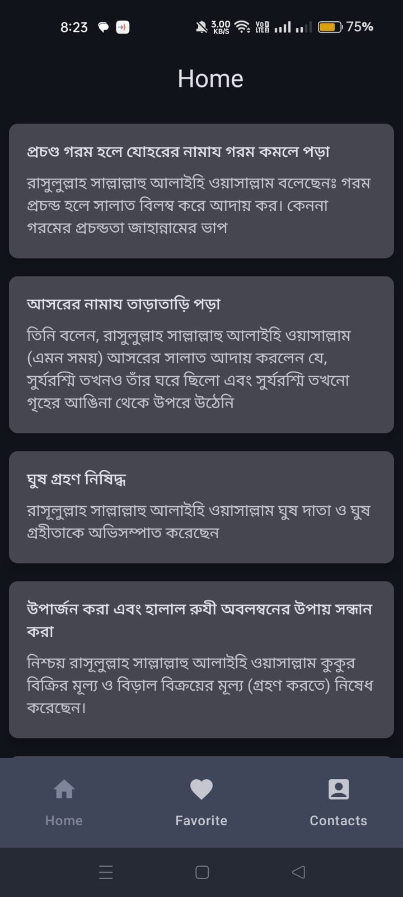
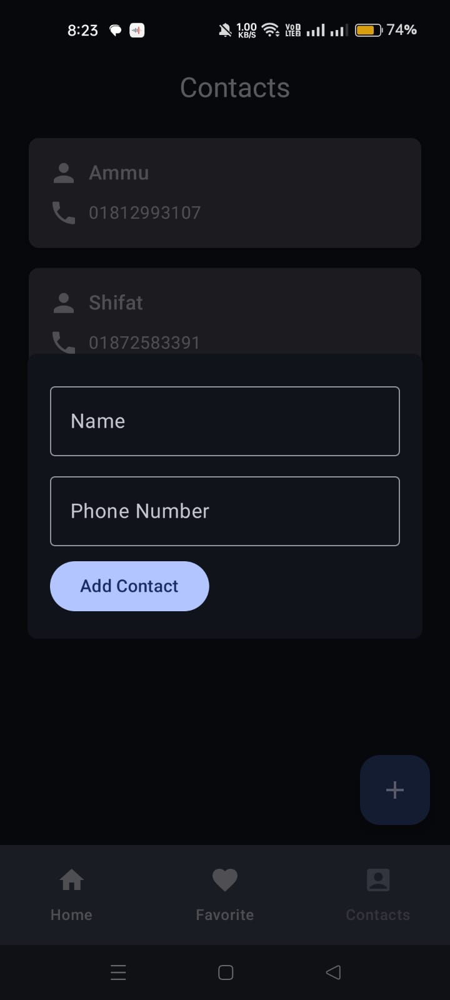
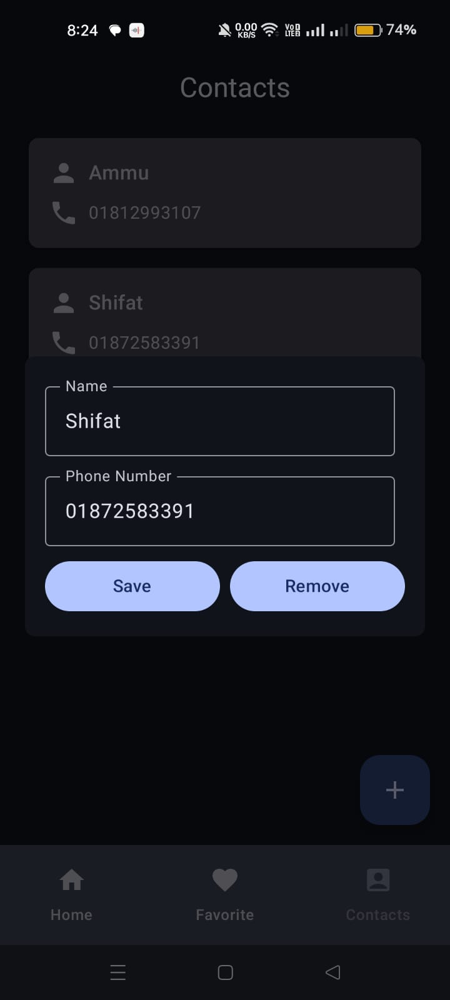

# 📱 MyHadis - Islamic Hadith Sharing App

<div align="center">
  
  
  [](https://android.com)
  [](https://kotlinlang.org)
  [](https://nodejs.org)
  [](https://android-arsenal.com/api?level=24)
  [](LICENSE)
</div>

---

## 📖 Overview

**MyHadis** is a comprehensive full-stack Islamic Hadith application designed for reading, sharing, and favoriting Islamic Hadith. Developed as part of the Web-Tech course under the **Robi BDAPPS SUST Android Project**, this application seamlessly integrates **BDAPPS Subscription** and **SMS APIs** to provide an exceptional user experience for sharing Islamic wisdom with friends and family.

<div align="center">
  <h3>✨ Share Islamic Wisdom • 📱 Modern Interface • 🔐 Secure Authentication • 🛠️ Full-Stack Solution</h3>
</div>

## 🏗️ Project Architecture

This is a full-stack Hadith application consisting of both Android frontend and backend components.

### 📁 Project Structure

```
MyHadith/
├── 📱 androidapp/                # Android Application
│   ├── app/                     # Main Android app module
│   │   ├── src/main/java/com/shifat/myhadis/
│   │   │   ├── api/            # 🔌 API interfaces
│   │   │   ├── di/             # 💉 Dependency injection
│   │   │   ├── model/          # 📋 Data models
│   │   │   ├── repository/     # 🗃️ Data repositories
│   │   │   ├── ui/screens/     # 🖥️ UI screens
│   │   │   └── theme/          # 🎨 App theming
│   │   └── res/                # 📱 Android resources
│   ├── AppScreenshots/         # 📸 App demonstrations
│   ├── build.gradle.kts        # 🛠️ Build configuration
│   └── settings.gradle.kts     # ⚙️ Gradle settings
├── 🛠️ backend/                  # Backend Server
│   ├── src/                    # 💻 Source code
│   │   ├── index.ts           # 🚀 Server entry point
│   │   └── router.ts          # 🛣️ API routes
│   ├── drizzle/               # 🗄️ Database schema & config
│   │   ├── db.ts              # 📊 Database connection
│   │   └── schema.ts          # 🏗️ Data models
│   ├── package.json           # 📦 Dependencies
│   ├── compose.yml            # 🐳 Docker Compose
│   └── Dockerfile             # 🐳 Docker configuration
└── README.md                  # 📖 This documentation
```

## 🌟 Key Features

<table>
<tr>
<td width="50%">

### 🔐 Authentication & Subscription
- **📱 Phone Number Authentication**: Secure login using mobile number verification
- **🔗 BDAPPS Integration**: Subscription service through Robi BDAPPS platform
- **🔑 OTP Verification**: Two-factor authentication for enhanced security

### 📚 Hadith Management
- **📖 Browse Hadith**: Access a comprehensive collection of Islamic Hadith with backend management
- **⭐ Favorite System**: Save/unsave and organize your favorite Hadith for easy access
- **📝 Detailed View**: View complete Hadith with source, narrator, and authenticity level

</td>
<td width="50%">

### 👥 Social Features
- **📞 Contact Management**: Add and manage friends in your circle using their mobile numbers
- **📲 SMS Sharing**: Send Hadith directly to contacts via SMS
- **📤 Bulk Messaging**: Share wisdom with multiple contacts simultaneously

### 🎨 User Interface
- **💡 Modern Design**: Clean, intuitive interface built with Jetpack Compose
- **🎯 Material Design 3**: Following Google's latest design principles
- **📱 Responsive Layout**: Optimized for various screen sizes
- **🌓 Dark/Light Theme**: Adaptive theming support

</td>
</tr>
</table>

## 🛠️ Technical Stack

<div align="center">
  
  
  
</div>

### 📱 Frontend Technologies (Android)
| Technology | Purpose | Version |
|------------|---------|---------|
| **Kotlin** | Primary programming language | 1.8+ |
| **Jetpack Compose** | Modern UI toolkit for native Android development | Latest |
| **Material Design 3** | Design system implementation | 1.1.2 |
| **Navigation Component** | Type-safe navigation between screens | 2.7.4 |
| **Retrofit** | HTTP client for API communication | 2.9.0 |
| **Dagger Hilt** | Dependency injection framework | 2.48 |

### 🛠️ Backend Technologies
| Technology | Purpose | Version |
|------------|---------|---------|
| **Node.js** | Runtime environment | Latest |
| **TypeScript** | Type-safe JavaScript | Latest |
| **Express.js** | Web framework | 4.19.2 |
| **Drizzle ORM** | Database ORM | 0.30.10 |
| **PostgreSQL** | Database | 3.4.4 |
| **Docker** | Containerization | Latest |
| **JWT** | Authentication tokens | 9.0.2 |

### 🏗️ Architecture Patterns
- **🏛️ MVVM (Model-View-ViewModel)**: Clean architecture separation in Android
- **📦 Repository Pattern**: Data layer abstraction
- **💉 Dependency Injection**: Modular and testable code structure
- **🌐 RESTful API**: Standard HTTP API design
- **🐳 Containerization**: Docker-based deployment

## 📱 App Screenshots

<div align="center">
  <h3>🎯 Seamless User Experience</h3>
</div>

### 🔐 Authentication Flow
> **Secure Login Process**: Users can log in using their mobile number. For first-time users, the app will prompt for subscription purchase with consent obtained through OTP verification.

<div align="center">
  
  <p><em>📱 Clean and intuitive login interface</em></p>
</div>

> **OTP Verification**: Users can confirm their subscription status through the secure OTP verification screen.

<div align="center"> 
  
  <p><em>🔑 Secure two-factor authentication</em></p>
</div>

### 📚 Core Features
> **Hadith Collection**: Browse through a vast collection of authenticated Hadith. The database is dynamically managed through our backend server.

<div align="center">
  
  <p><em>📖 Beautiful Hadith browsing experience</em></p>
</div>

> **Favorites Management**: Access your saved favorite Hadith collection for quick reference and daily reading.

<div align="center">
  
  <p><em>⭐ Personal collection of favorite Hadith</em></p>
</div>

### 👥 Social & Contact Features
> **Contact Management**: View and manage your circle of friends. Easily add, remove, or edit contacts within your network.

<div align="center">
  
  <p><em>📞 Comprehensive contact management system</em></p>
</div>

<div align="center">
  <table>
    <tr>
      <td align="center">
        
        <p><em>➕ Add new contacts</em></p>
      </td>
      <td align="center">
        
        <p><em>✏️ Edit existing contacts</em></p>
      </td>
      <td align="center">
        
        <p><em>📤 Share Hadith via SMS</em></p>
      </td>
    </tr>
  </table>
</div>

## 🎥 Video Demonstration

<div align="center">
  <a href="https://drive.google.com/file/d/1dAyV4y-uU6GPcfr00y9ra9XuavzT9E0J/view?usp=drive_link">
    
  </a>
  <p><em>📹 Complete application walkthrough and feature demonstration</em></p>
</div>

## 🚀 Getting Started

<div align="center">
  <h3>📋 Requirements & Installation Guide</h3>
</div>

### 🔧 Prerequisites
Before you begin, ensure you have the following requirements:

| Requirement | Version | Purpose |
|-------------|---------|---------|
| **Android Studio** | Arctic Fox (2020.3.1) or later | Android development environment |
| **Android SDK** | 24+ | Target platform |
| **Kotlin** | 1.8+ | Programming language |
| **JDK** | 8+ | Java development kit |
| **Node.js** | 16+ | Backend runtime |
| **PostgreSQL** | 12+ | Database |
| **Docker** | Latest | Containerization (optional) |

### 📱 Android App Setup

<details>
<summary><strong>🛠️ Development Setup</strong></summary>

```bash
# Clone the repository
git clone <repository-url>
cd MyHadith

# Navigate to Android app
cd androidapp

# Build the project
./gradlew build

# Run the app (with device/emulator connected)
./gradlew installDebug
```

</details>

<details>
<summary><strong>📦 APK Installation</strong></summary>

- Locate the downloaded APK file on your Android device
- Navigate to **Settings** > **Security** > **Unknown Sources**
- Enable "Install from unknown sources" for the browser/file manager you're using
- Tap the APK file to begin the installation process
- Grant necessary permissions when prompted

</details>

### 🛠️ Backend Setup

<details>
<summary><strong>💻 Local Development</strong></summary>

```bash
# Navigate to backend directory
cd backend

# Install dependencies
npm install

# Set up environment variables
cp .env.example .env
# Edit .env file with your configuration

# Run database migrations
npm run db:migrate

# Start development server
npm run dev

# Server will be available at http://localhost:3000
```

</details>

<details>
<summary><strong>🐳 Docker Deployment</strong></summary>

```bash
# Navigate to backend directory
cd backend

# Build and run with Docker Compose
docker-compose up -d

# Or build and run manually
docker build -t myhadith-backend .
docker run -p 3000:3000 -d myhadith-backend
```

</details>

### 🔧 Configuration

<details>
<summary><strong>🔐 Authentication Configuration</strong></summary>

```bash
# Backend environment variables (.env)
DB_HOST=localhost
DB_PORT=5432
DB_NAME=myhadith
DB_USER=your_username
DB_PASSWORD=your_password
JWT_SECRET=your_jwt_secret
BDAPPS_API_KEY=your_bdapps_key
SMS_API_ENDPOINT=your_sms_endpoint
```

</details>

<details>
<summary><strong>📱 Android Configuration</strong></summary>

```kotlin
// Update API base URL in NetworkModule.kt
object NetworkModule {
    private const val BASE_URL = "http://your-backend-url:3000/"
    
    @Provides
    @Singleton
    fun provideRetrofit(): Retrofit {
        return Retrofit.Builder()
            .baseUrl(BASE_URL)
            .addConverterFactory(GsonConverterFactory.create())
            .build()
    }
}
```

</details>

### ⚠️ Important Setup Notes

<details>
<summary><strong>🔴 BDApps Restrictions</strong></summary>

Due to BDApps platform limitations, the following restrictions apply:

1. **✅ Whitelisted Phone Numbers** - Only pre-approved numbers can register
2. **🌐 Internet Connection** - Essential for API communication and verification
3. **📱 SMS Permissions** - Needed for sharing functionality and OTP verification
4. **💳 Valid Subscription** - Required for accessing premium features

> **📝 Note**: These restrictions are imposed by the BDApps platform and are necessary for compliance with their terms of service.

</details>

## 🔌 API Documentation

<div align="center">
  <h3>🌐 RESTful API Endpoints</h3>
</div>

### 🔐 Authentication Endpoints
| Method | Endpoint | Description | Parameters |
|--------|----------|-------------|------------|
| `POST` | `/subscribe` | User subscription | `SubscribeRequest` |
| `POST` | `/confirm_subscription` | OTP verification | `OTPRequest` |
| `GET` | `/check_subscription/{mobile}` | Check subscription status | `mobile: String` |

### 📚 Hadith Management Endpoints
| Method | Endpoint | Description | Parameters |
|--------|----------|-------------|------------|
| `GET` | `/hadith` | Fetch all Hadith | - |
| `GET` | `/hadith/fav/{mobile}` | Fetch favorite Hadith | `mobile: String` |
| `POST` | `/hadith/fav` | Add favorite Hadith | `FavoriteRequest` |
| `POST` | `/hadith/fav/delete` | Remove favorite Hadith | `FavoriteRequest` |

### 👥 Contact & SMS Endpoints
| Method | Endpoint | Description | Parameters |
|--------|----------|-------------|------------|
| `GET` | `/favContacts/{mobile}` | Fetch user contacts | `mobile: String` |
| `POST` | `/favContact/{mobile}` | Add new contact | `ContactRequest` |
| `PUT` | `/favContact/{mobile}` | Update existing contact | `ContactRequest` |
| `POST` | `/deleteContact` | Delete contact | `DeleteRequest` |
| `POST` | `/send-sms` | Send Hadith via SMS | `SMSRequest` |

<div align="center">
  
  
  
</div>

## 📦 Dependencies

### 📱 Android Dependencies
<details>
<summary><strong>📦 Core Dependencies</strong></summary>

```kotlin
// Core Android Libraries
implementation("androidx.core:core-ktx:1.12.0")
implementation("androidx.lifecycle:lifecycle-runtime-ktx:2.7.0")
implementation("androidx.activity:activity-compose:1.8.2")

// Jetpack Compose UI Framework
implementation("androidx.compose.ui:ui:1.5.4")
implementation("androidx.compose.material3:material3:1.1.2")
implementation("androidx.navigation:navigation-compose:2.7.4")

// Dependency Injection
implementation("com.google.dagger:hilt-android:2.48")
implementation("androidx.hilt:hilt-navigation-compose:1.1.0")

// Network & API Communication
implementation("com.squareup.retrofit2:retrofit:2.9.0")
implementation("com.squareup.retrofit2:converter-gson:2.9.0")

// Asynchronous Programming
implementation("org.jetbrains.kotlinx:kotlinx-coroutines-android:1.7.3")
```

</details>

### 🛠️ Backend Dependencies
<details>
<summary><strong>📦 Core Dependencies</strong></summary>

```json
{
  "dependencies": {
    "express": "^4.19.2",
    "drizzle-orm": "^0.30.10",
    "postgres": "^3.4.4",
    "jsonwebtoken": "^9.0.2",
    "bcrypt": "^5.1.1",
    "axios": "^1.7.2",
    "dotenv": "^16.4.5",
    "pm2": "^5.4.0"
  },
  "devDependencies": {
    "@types/express": "^4.17.21",
    "@types/bcrypt": "^5.0.2",
    "drizzle-kit": "^0.21.4",
    "ts-node": "^10.9.2",
    "nodemon": "^3.1.1"
  }
}
```

</details>

## 🧪 Testing & Quality Assurance

<div align="center">
  <h3>🔍 Quality Assurance</h3>
</div>

### 📱 Android Testing
| Test Type | Coverage | Framework |
|-----------|----------|-----------|
| **Unit Tests** | ViewModels & Repositories | JUnit 4 |
| **Integration Tests** | API calls & Data flow | Retrofit + MockWebServer |
| **UI Tests** | Critical user flows | Espresso + Compose Testing |

### 🛠️ Backend Testing
| Test Type | Coverage | Framework |
|-----------|----------|-----------|
| **Unit Tests** | Business logic & utilities | Jest |
| **Integration Tests** | API endpoints | Supertest |
| **Database Tests** | ORM operations | Drizzle + Jest |

## 🚨 Current Status & Limitations

<div align="center">
  <h3>⚠️ Important Information</h3>
</div>

### 🔴 Current Status
> **⚠️ Application Status**: The app is currently **offline** as the backend server has been shut down.

### 🚧 BDApps Restrictions
Due to BDApps platform limitations, the following restrictions apply:

<table>
<tr>
<td width="33%">

#### 📱 Registration
- Only **whitelisted phone numbers** can register
- Numbers must be pre-approved by BDApps
- Registration requires active subscription

</td>
<td width="33%">

#### 📞 Contact Management
- SMS functionality limited to **whitelisted contacts**
- Contact verification required
- Bulk operations may have limitations

</td>
<td width="33%">

#### 💰 Subscription
- **Active subscription required** for full access
- OTP verification mandatory
- Payment through BDApps platform

</td>
</tr>
</table>

## 👥 Development Team

<div align="center">
  <h3>🤝 Meet the Developers</h3>
</div>

<table>
<tr>
<td align="center" width="50%">

### 👨‍💻 Lead Developer
**Shaifur Rahman Shifat**

<div align="center">
  
  <br>
  
</div>

**Responsibilities**: Android Development, UI/UX Design, Frontend Architecture

</td>
<td align="center" width="50%">

### 👨‍💻 Co-Developer
**Bipul Hasan**

<div align="center">
  
  <br>
  
</div>

**Responsibilities**: Backend Development, API Design, Database Management

</td>
</tr>
</table>

<div align="center">
  <h4>🎓 Academic Project</h4>
  <p><em>Developed as part of the Web-Tech course under <strong>Robi BDAPPS SUST Android Project</strong></em></p>
</div>

## 📄 License & Copyright

<div align="center">
  <h3>⚖️ Legal Information</h3>
</div>

<div align="center">
  
  
</div>

> **📋 Academic Project**: This project was developed as part of the Web-Tech course under the **Robi BDAPPS SUST Android Project** program.

> **©️ Copyright**: All rights reserved. This project is proprietary and confidential.

---

<div align="center">
  <h3>🌟 Thank You for Your Interest!</h3>
  <p><em>We appreciate your time in exploring the MyHadis full-stack application.</em></p>
  
  
  
</div>

---

<div align="center">
  <p><strong>Built with ❤️ for the Islamic community</strong></p>
  <p><em>May this application help spread the wisdom of Islamic teachings</em></p>
</div>
