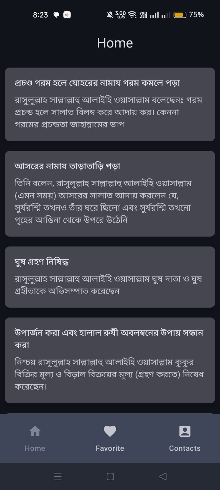
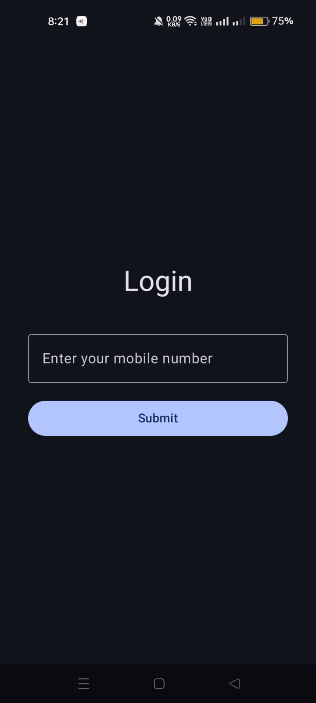
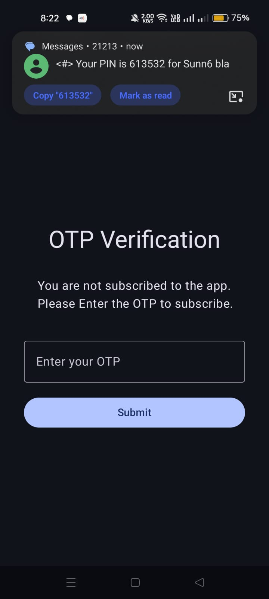
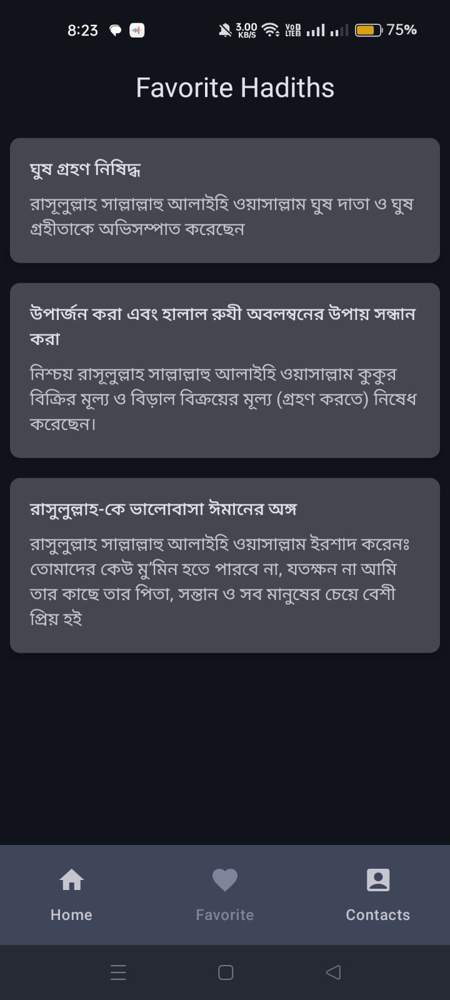
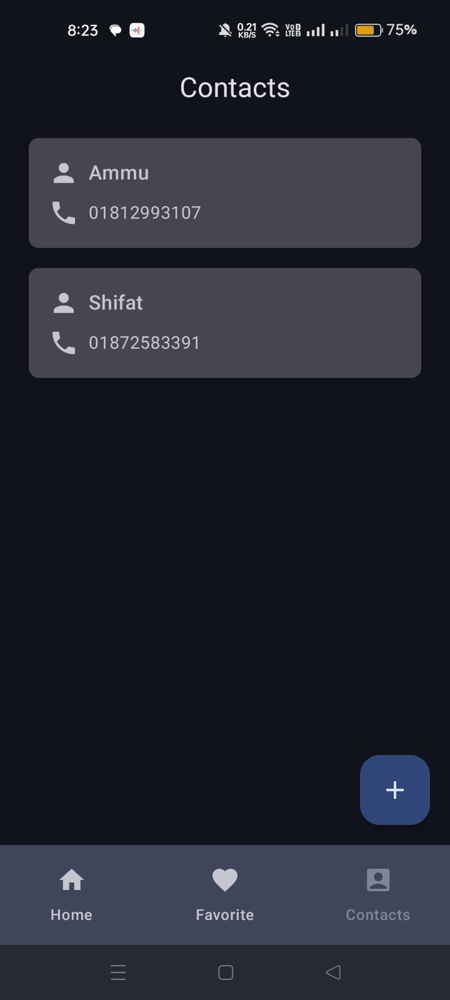
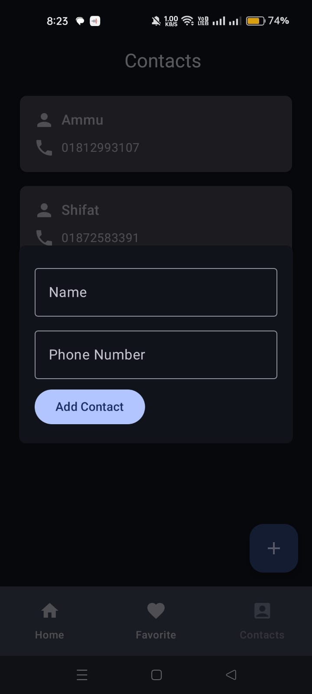
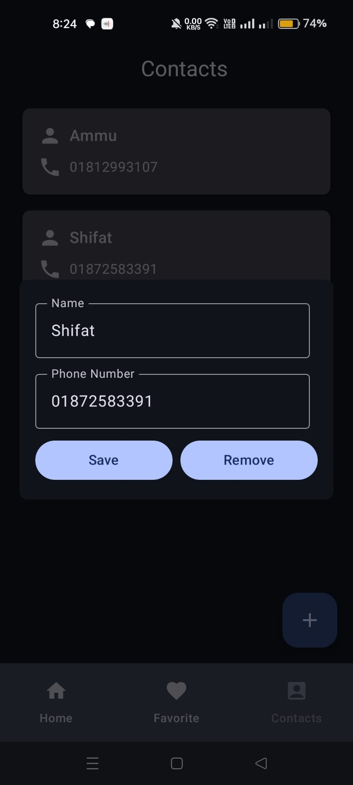
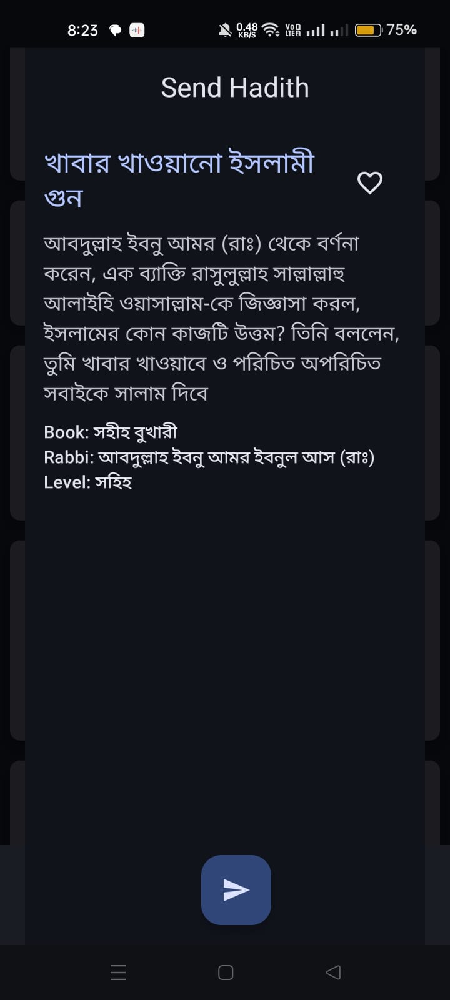

# 📱 MyHadis - Islamic Hadith Sharing App

<div align="center">
  
  
  [](https://android.com)
  [](https://kotlinlang.org)
  [](https://android-arsenal.com/api?level=24)
  [](LICENSE)
</div>

---

## 📖 Overview

**MyHadis** is a comprehensive Android application designed for reading, sharing, and favoriting Islamic Hadith. Developed as part of the Web-Tech course under the **Robi BDAPPS SUST Android Project**, this app seamlessly integrates **BDAPPS Subscription** and **SMS APIs** to provide an exceptional user experience for sharing Islamic wisdom with friends and family.

<div align="center">
  <h3>✨ Share Islamic Wisdom • 📱 Modern Interface • 🔐 Secure Authentication</h3>
</div>

## 🌟 Key Features

<table>
<tr>
<td width="50%">

### 🔐 Authentication & Subscription
- **📱 Phone Number Authentication**: Secure login using mobile number verification
- **🔗 BDAPPS Integration**: Subscription service through Robi BDAPPS platform
- **🔑 OTP Verification**: Two-factor authentication for enhanced security

### 📚 Hadith Management
- **📖 Browse Hadith**: Access a comprehensive collection of Islamic Hadith with backend management
- **⭐ Favorite System**: Save/unsave and organize your favorite Hadith for easy access
- **📝 Detailed View**: View complete Hadith with source, narrator, and authenticity level

</td>
<td width="50%">

### 👥 Social Features
- **📞 Contact Management**: Add and manage friends in your circle using their mobile numbers
- **📲 SMS Sharing**: Send Hadith directly to contacts via SMS
- **📤 Bulk Messaging**: Share wisdom with multiple contacts simultaneously

### 🎨 User Interface
- **💡 Modern Design**: Clean, intuitive interface built with Jetpack Compose
- **🎯 Material Design 3**: Following Google's latest design principles
- **📱 Responsive Layout**: Optimized for various screen sizes
- **🌓 Dark/Light Theme**: Adaptive theming support

</td>
</tr>
</table>

## 🛠️ Technical Architecture

<div align="center">
  
  
  
</div>

### 🎯 Frontend Technologies
| Technology | Purpose | Version |
|------------|---------|---------|
| **Kotlin** | Primary programming language | 1.8+ |
| **Jetpack Compose** | Modern UI toolkit for native Android development | Latest |
| **Material Design 3** | Design system implementation | 1.1.2 |
| **Navigation Component** | Type-safe navigation between screens | 2.7.4 |

### 🔧 Backend Integration
| Component | Purpose | Implementation |
|-----------|---------|----------------|
| **Retrofit** | HTTP client for API communication | 2.9.0 |
| **Kotlin Coroutines** | Asynchronous programming for smooth performance | 1.7.3 |
| **StateFlow** | Reactive state management | Built-in |
| **Dagger Hilt** | Dependency injection framework | 2.48 |

### 🏗️ Architecture Patterns
- **🏛️ MVVM (Model-View-ViewModel)**: Clean architecture separation
- **📦 Repository Pattern**: Data layer abstraction
- **💉 Dependency Injection**: Modular and testable code structure

## 📱 App Screenshots

<div align="center">
  <h3>🎯 Seamless User Experience</h3>
</div>

### 🔐 Authentication Flow
> **Secure Login Process**: Users can log in using their mobile number. For first-time users, the app will prompt for subscription purchase with consent obtained through OTP verification.

<div align="center">
  
  <p><em>📱 Clean and intuitive login interface</em></p>
</div>

> **OTP Verification**: Users can confirm their subscription status through the secure OTP verification screen.

<div align="center"> 
  
  <p><em>🔑 Secure two-factor authentication</em></p>
</div>

### 📚 Core Features
> **Hadith Collection**: Browse through a vast collection of authenticated Hadith. The database is dynamically managed through our backend server.

<div align="center">
  
  <p><em>📖 Beautiful Hadith browsing experience</em></p>
</div>

> **Favorites Management**: Access your saved favorite Hadith collection for quick reference and daily reading.

<div align="center">
  
  <p><em>⭐ Personal collection of favorite Hadith</em></p>
</div>

### 👥 Social & Contact Features
> **Contact Management**: View and manage your circle of friends. Easily add, remove, or edit contacts within your network.

<div align="center">
  
  <p><em>📞 Comprehensive contact management system</em></p>
</div>

<div align="center">
  <table>
    <tr>
      <td align="center">
        
        <p><em>➕ Add new contacts</em></p>
      </td>
      <td align="center">
        
        <p><em>✏️ Edit existing contacts</em></p>
      </td>
      <td align="center">
        
        <p><em>📤 Share Hadith via SMS</em></p>
      </td>
    </tr>
  </table>
</div>

## 🎥 Video Demonstration

<div align="center">
  <a href="https://drive.google.com/file/d/1dAyV4y-uU6GPcfr00y9ra9XuavzT9E0J/view?usp=drive_link">
    
  </a>
  <p><em>📹 Complete application walkthrough and feature demonstration</em></p>
</div>

---

## 🚀 Getting Started

<div align="center">
  <h3>📋 Requirements & Installation Guide</h3>
</div>

### 🔧 Prerequisites
Before you begin, ensure you have the following requirements:

| Requirement | Version | Purpose |
|-------------|---------|---------|
| **Android Studio** | Arctic Fox (2020.3.1) or later | Development environment |
| **Android SDK** | 24+ | Target platform |
| **Kotlin** | 1.8+ | Programming language |
| **JDK** | 8+ | Java development kit |

### 📱 Installation Steps

<details>
<summary><strong>📦 Step 1: Download the APK</strong></summary>

- Locate the downloaded APK file on your Android device
- Navigate to **Settings** > **Security** > **Unknown Sources**
- Enable "Install from unknown sources" for the browser/file manager you're using

</details>

<details>
<summary><strong>⚙️ Step 2: Install the Application</strong></summary>

- Tap the APK file to begin the installation process
- Grant necessary permissions when prompted
- Follow the on-screen instructions to complete the installation
- Launch the app from your app drawer

</details>

<details>
<summary><strong>🔐 Step 3: Registration Process</strong></summary>

- Use only **whitelisted phone numbers** from BDApps for registration
- Ensure your device has a stable internet connection for verification
- Complete the OTP verification process as prompted
- Accept the subscription terms and conditions

</details>

<details>
<summary><strong>👥 Step 4: Adding Contacts</strong></summary>

- Add only **whitelisted phone numbers** to your contact list
- This restriction is necessary for SMS API functionality due to BDApps requirements
- Verify contact numbers before adding to avoid errors

</details>

> **⚠️ Important**: Due to BDApps restrictions, only pre-approved (whitelisted) phone numbers can be used for registration and contact management.

## 🔧 Configuration

### 🔗 BDApps Integration
The application requires proper configuration of BDApps services for full functionality:

<details>
<summary><strong>📡 API Configuration</strong></summary>

```kotlin
// HadisApi.kt - Main API interface
interface HadisApi {
    @GET("hadith")
    suspend fun getHadis(): Response<List<Hadis>>
    
    @POST("subscribe")
    suspend fun subscribeUser(@Body request: SubscribeRequest): Response<SubscribeResponse>
    
    @POST("send-sms")
    suspend fun sendHadis(@Body request: SendHadisRequest): Response<String>
}
```

</details>

### 📚 Dependencies
Key dependencies and their purposes:

<details>
<summary><strong>📦 Core Dependencies</strong></summary>

```kotlin
// Core Android Libraries
implementation("androidx.core:core-ktx:1.12.0")
implementation("androidx.lifecycle:lifecycle-runtime-ktx:2.7.0")
implementation("androidx.activity:activity-compose:1.8.2")

// Jetpack Compose UI Framework
implementation("androidx.compose.ui:ui:1.5.4")
implementation("androidx.compose.material3:material3:1.1.2")
implementation("androidx.navigation:navigation-compose:2.7.4")

// Dependency Injection
implementation("com.google.dagger:hilt-android:2.48")
implementation("androidx.hilt:hilt-navigation-compose:1.1.0")

// Network & API Communication
implementation("com.squareup.retrofit2:retrofit:2.9.0")
implementation("com.squareup.retrofit2:converter-gson:2.9.0")

// Asynchronous Programming
implementation("org.jetbrains.kotlinx:kotlinx-coroutines-android:1.7.3")
```

</details>

## 📊 Project Structure

<div align="center">
  <h3>🗂️ Clean Architecture Implementation</h3>
</div>

```
📁 app/
├── 📁 src/main/java/com/shifat/myhadis/
│   ├── 📁 api/                    # 🔌 API interfaces and models
│   │   └── 📄 HadisApi.kt
│   ├── 📁 di/                     # 💉 Dependency injection modules
│   │   └── 📄 NetworkModule.kt
│   ├── 📁 model/                  # 📋 Data models
│   │   ├── 📄 Hadis.kt
│   │   ├── 📄 Contact.kt
│   │   └── 📄 ResponseModels.kt
│   ├── 📁 repository/             # 🗃️ Data repositories
│   │   ├── 📄 HadisRepository.kt
│   │   ├── 📄 AuthRepository.kt
│   │   └── 📄 ContactsRepository.kt
│   ├── 📁 ui/
│   │   ├── 📁 screens/            # 🖥️ UI screens
│   │   │   ├── 📄 HomeScreen.kt
│   │   │   ├── 📄 FavoriteScreen.kt
│   │   │   ├── 📄 ContactScreen.kt
│   │   │   ├── 📄 LoginScreen.kt
│   │   │   └── 📄 OtpScreen.kt
│   │   ├── 📁 common/             # 🔧 Reusable UI components
│   │   │   ├── 📄 HadisCard.kt
│   │   │   ├── 📄 BottomBar.kt
│   │   │   └── 📄 TopBar.kt
│   │   └── 📁 theme/              # 🎨 App theming
│   │       ├── 📄 Color.kt
│   │       ├── 📄 Theme.kt
│   │       └── 📄 Type.kt
│   ├── 📄 App.kt                  # 🧭 Main app navigation
│   └── 📄 MainActivity.kt         # 🚀 Application entry point
```

<div align="center">
  <table>
    <tr>
      <td align="center">
        <h4>📱 Presentation Layer</h4>
        <p>UI screens & components</p>
      </td>
      <td align="center">
        <h4>🔄 Domain Layer</h4>
        <p>Business logic & use cases</p>
      </td>
      <td align="center">
        <h4>💾 Data Layer</h4>
        <p>Repositories & API calls</p>
      </td>
    </tr>
  </table>
</div>

## 🔌 API Integration

<div align="center">
  <h3>🌐 RESTful API Endpoints</h3>
</div>

### 🔐 Authentication Endpoints
| Method | Endpoint | Description | Parameters |
|--------|----------|-------------|------------|
| `POST` | `/subscribe` | User subscription | `SubscribeRequest` |
| `POST` | `/confirm_subscription` | OTP verification | `OTPRequest` |
| `GET` | `/check_subscription/{mobile}` | Check subscription status | `mobile: String` |

### 📚 Hadith Management Endpoints
| Method | Endpoint | Description | Parameters |
|--------|----------|-------------|------------|
| `GET` | `/hadith` | Fetch all Hadith | - |
| `GET` | `/hadith/fav/{mobile}` | Fetch favorite Hadith | `mobile: String` |
| `POST` | `/hadith/fav` | Add favorite Hadith | `FavoriteRequest` |
| `POST` | `/hadith/fav/delete` | Remove favorite Hadith | `FavoriteRequest` |

### 👥 Contact & SMS Endpoints
| Method | Endpoint | Description | Parameters |
|--------|----------|-------------|------------|
| `GET` | `/favContacts/{mobile}` | Fetch user contacts | `mobile: String` |
| `POST` | `/favContact/{mobile}` | Add new contact | `ContactRequest` |
| `PUT` | `/favContact/{mobile}` | Update existing contact | `ContactRequest` |
| `POST` | `/deleteContact` | Delete contact | `DeleteRequest` |
| `POST` | `/send-sms` | Send Hadith via SMS | `SMSRequest` |

<div align="center">
  
  
  
</div>

## 📈 Features Breakdown

<div align="center">
  <h3>🎯 Comprehensive Feature Set</h3>
</div>

### 🔥 Core Functionality

<table>
<tr>
<td width="50%">

#### 🔐 Authentication System
- **📱 Phone-based Login**: Secure mobile number authentication
- **🔑 OTP Verification**: Two-factor authentication via BDApps
- **🔒 Session Management**: Persistent user sessions
- **🛡️ Security**: Encrypted data transmission

#### 📚 Hadith Management
- **🔍 Browse Collection**: Comprehensive authenticated Hadith database
- **🔎 Search & Filter**: Advanced search capabilities
- **⭐ Favorites System**: Personal collection with local storage
- **📝 Detailed Views**: Complete Hadith with metadata

</td>
<td width="50%">

#### 👥 Contact Management
- **➕ Add/Edit/Delete**: Full CRUD operations for contacts
- **📞 WhatsApp-style UI**: Familiar and intuitive interface
- **📋 Bulk Operations**: Manage multiple contacts simultaneously
- **🔄 Sync**: Real-time synchronization with backend

#### 📲 SMS Integration
- **📤 Send Hadith**: Direct SMS sharing to contacts
- **📊 Bulk Messaging**: Share with multiple contacts at once
- **✅ Delivery Status**: Track message delivery status
- **📱 BDApps Integration**: Seamless SMS API integration

</td>
</tr>
</table>

### ✨ UI/UX Features

<div align="center">
  <table>
    <tr>
      <td align="center">
        <h4>📱 Responsive Design</h4>
        <p>Adapts to different screen sizes and orientations</p>
      </td>
      <td align="center">
        <h4>🎬 Smooth Animations</h4>
        <p>Fluid transitions and micro-interactions</p>
      </td>
      <td align="center">
        <h4>⏳ Loading States</h4>
        <p>Clear feedback during operations</p>
      </td>
    </tr>
    <tr>
      <td align="center">
        <h4>🚨 Error Handling</h4>
        <p>User-friendly error messages and recovery</p>
      </td>
      <td align="center">
        <h4>♿ Accessibility</h4>
        <p>Support for accessibility features</p>
      </td>
      <td align="center">
        <h4>🌓 Theming</h4>
        <p>Dark/Light theme with Material Design 3</p>
      </td>
    </tr>
  </table>
</div>

## 📦 Build Configuration

### ⚙️ Application Configuration
```kotlin
android {
    namespace = "com.shifat.myhadis"
    compileSdk = 34
    
    defaultConfig {
        applicationId = "com.shifat.myhadis"
        minSdk = 24
        targetSdk = 34
        versionCode = 1
        versionName = "1.0"
        
        testInstrumentationRunner = "androidx.test.runner.AndroidJUnitRunner"
        vectorDrawables.useSupportLibrary = true
    }
    
    buildFeatures {
        compose = true
    }
    
    composeOptions {
        kotlinCompilerExtensionVersion = "1.5.4"
    }
}
```

### 🚀 Build Variants
| Variant | Purpose | Features |
|---------|---------|----------|
| **Debug** | Development build | Logging enabled, debugging tools |
| **Release** | Production build | Optimized, minified, obfuscated |

---

## 🔍 Code Quality & Testing

<div align="center">
  <h3>🧪 Quality Assurance</h3>
</div>

### 🧪 Testing Strategy
| Test Type | Coverage | Framework |
|-----------|----------|-----------|
| **Unit Tests** | ViewModels & Repositories | JUnit 4 |
| **Integration Tests** | API calls & Data flow | Retrofit + MockWebServer |
| **UI Tests** | Critical user flows | Espresso + Compose Testing |

### 📐 Code Organization Principles
<table>
<tr>
<td width="33%">

#### 🏗️ Clean Architecture
- **Separation of Concerns**: Clear layer boundaries
- **Dependency Rule**: Dependencies point inward
- **Testability**: Easy to unit test components

</td>
<td width="33%">

#### 🎯 SOLID Principles
- **Single Responsibility**: Each class has one job
- **Open/Closed**: Open for extension, closed for modification
- **Liskov Substitution**: Subtypes must be substitutable
- **Interface Segregation**: Specific interfaces
- **Dependency Inversion**: Depend on abstractions

</td>
<td width="33%">

#### 💉 Dependency Injection
- **Loose Coupling**: Components are independent
- **Easy Testing**: Mock dependencies easily
- **Maintainable**: Clean modular architecture

</td>
</tr>
</table>

---

## 📚 Related Repositories

<div align="center">
  <h3>🔗 Project Ecosystem</h3>
</div>

<table>
<tr>
<td align="center" width="50%">

### 📱 Frontend Repository
<a href="https://github.com/yourusername/myhadith-android">
  
</a>

**MyHadith Android Application**
- Jetpack Compose UI
- MVVM Architecture
- Material Design 3

</td>
<td align="center" width="50%">

### 🛠️ Backend Repository
<a href="https://github.com/yourusername/myhadith-backend">
  
</a>

**MyHadith Backend API**
- RESTful API Services
- BDApps Integration
- Database Management

</td>
</tr>
</table>

---

## 🚨 Important Information

<div align="center">
  <h3>⚠️ Current Status & Limitations</h3>
</div>

### 🔴 Current Status
> **⚠️ Application Status**: The app is currently **offline** as the backend server has been shut down.

### 🚧 BDApps Restrictions
Due to BDApps platform limitations, the following restrictions apply:

<table>
<tr>
<td width="33%">

#### 📱 Registration
- Only **whitelisted phone numbers** can register
- Numbers must be pre-approved by BDApps
- Registration requires active subscription

</td>
<td width="33%">

#### 📞 Contact Management
- SMS functionality limited to **whitelisted contacts**
- Contact verification required
- Bulk operations may have limitations

</td>
<td width="33%">

#### 💰 Subscription
- **Active subscription required** for full access
- OTP verification mandatory
- Payment through BDApps platform

</td>
</tr>
</table>

### 📋 Prerequisites for Testing
Before testing the application, ensure you have:

1. **✅ Whitelisted Phone Number** - Required for registration and authentication
2. **🌐 Internet Connection** - Essential for API communication and verification
3. **📱 SMS Permissions** - Needed for sharing functionality and OTP verification
4. **💳 Valid Subscription** - Required for accessing premium features

> **📝 Note**: These restrictions are imposed by the BDApps platform and are necessary for compliance with their terms of service.

---

## 👥 Development Team

<div align="center">
  <h3>🤝 Meet the Developers</h3>
</div>

<table>
<tr>
<td align="center" width="50%">

### �‍💻 Lead Developer
**Shaifur Rahman Shifat**

<div align="center">
  
  <br>
  
</div>

</td>
<td align="center" width="50%">

### 👨‍💻 Co-Developer
**Bipul Hasan**

<div align="center">
  
  <br>
  
</div>

</td>
</tr>
</table>

<div align="center">
  <h4>🎓 Academic Project</h4>
  <p><em>Developed as part of the Web-Tech course under <strong>Robi BDAPPS SUST Android Project</strong></em></p>
</div>

---

## 📄 License & Copyright

<div align="center">
  <h3>⚖️ Legal Information</h3>
</div>

<div align="center">
  
  
</div>

> **📋 Academic Project**: This project was developed as part of the Web-Tech course under the **Robi BDAPPS SUST Android Project** program.

> **©️ Copyright**: All rights reserved. This project is proprietary and confidential.

---

<div align="center">
  <h3>🌟 Thank You for Your Interest!</h3>
  <p><em>We appreciate your time in exploring the MyHadis application.</em></p>
  
  
  
</div>

---

<div align="center">
  <p><strong>Built with ❤️ for the Islamic community</strong></p>
  <p><em>May this application help spread the wisdom of Islamic teachings</em></p>
</div>
 